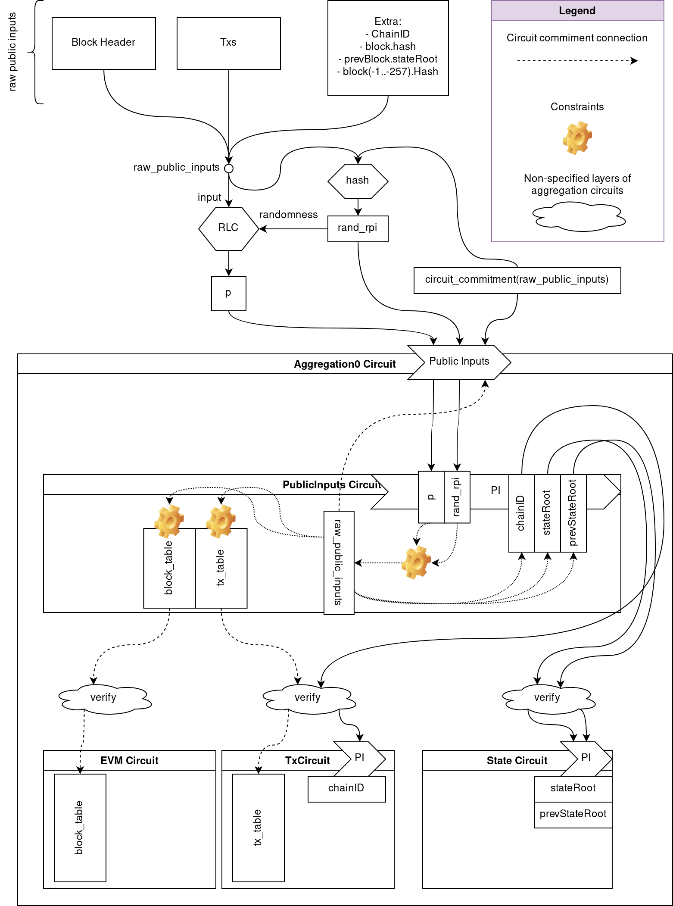

# Public Inputs

The following list contains all the data used by an Ethereum client to
calculate a block and to define this calculated block.

## Block

- Hash: 256 bits
- Block Fields used in RLP:
    - ParentHash: 256 bits
    - UncleHash: 256 bits
    - Coinbase: 160 bits
    - Root: 256 bits (State Trie Root)
    - TxHash: 256 bits (Txs Trie Root)
    - ReceiptHash: 256 bits (Receipts Trie Root)
    - Bloom: 256 bytes
    - Difficulty: 256 bits
    - Number: 64 bits
    - GasLimit: 64 bits
    - GasUsed: 64 bits
    - Time: 64 bits
    - Extra: 0 bytes
    - MixDigest: 256 bits
    - Nonce: 64 bits
    - BaseFee: 256 bits (BaseFee was added by EIP-1559 and is ignored in legacy headers.)

### Circuits

- Block Hash verifier
    - All fields
- EVM Circuit Block Table
    - Coinbase
    - GasLimit
    - Number
    - Time
    - Difficulty
    - BaseFee
- State Circuit
    - Block.Root

## Previous Blocks

- block[-1].Root
- block[-1..-257].Hash

### Circuits

- EVM Circuit Block Table
    - block[-1..-257].Hash
- State Circuit
    - block[-1].Root

## Globals

- ChainID: 64 bits

### Circuits

- EVM Circuit Block Table
    - ChainID
- TxCircuit
    - ChainID

## Transactions

- Nonce: 64 bits
- GasPrice: 256 bits
- Gas: 64 bits
- CallerAddress: 160 bits
- CalleeAddress: 160 bits
- IsCreate: 1 bit
- Value: 256 bits
- CallDataLength: 64 bits
- CallData: CallDataLength bytes
- TxSignHash: 256 bits
- Signature
    - v: 256 bits
    - r: 256 bits
    - s: 256 bits

Fields used for RLP for TxSignHash:
- Nonce
- GasPrice
- Gas
- CalleeAddress
- Value
- CallData
- ChainID

Fields used for RLP for TxHash:
- Nonce
- GasPrice
- Gas
- CalleeAddress
- Value
- CallData
- ChainID
- Signature.v
- Signature.r
- Signature.s

### Circuits

- TxCircuit
    - All Fields

# Necessary public Data

Some of the data defined in the previous section will be available along with
the proof when it is submitted for verification.  More data than strictly
necessary to verify a proof will be included in order to allow a node to
synchronize the State Trie.

## Data to synchronize the State Trie

In order to synchronize the State Trie after a new block (assuming we have the sate
of the previous block), we need the at least the following data:

- For each tx
    - GasPrice: 256 bits
    - Gas: 64 bits
    - CallerAddress: 160 bits
    - CalleeAddress: 160 bits
    - Value: 256 bits
    - CallData: CallDataLength bytes

The signature is not needed to synchronize the State Trie, and the nonce can be
inferred from the State Trie of the previous block.

## Data to calculate a new block

In order to calculate a new block (assuming we have the sate of the previous
block), we need at least the following data:

- block[-1..-257].Hash
    - These hashes can't be calculated by a synchronizer unless the Header fields are published.
- A way to prove that block[-1].Root (calculated from the known State Trie) is included in block[-1..-257].Hash
    - A simple way to resolve this is by publishing the StateRoot with each proof (liked via public input)

## Data to verify synchronization

Eventhough a node may have enough data to synchronize the State Trie, the node
can't verify if the computed State Trie is correct (it's the same used in the
proof).  For that it the following value should be published:

- StateRoot

# Public Input approach

The necessary public data may not be equal to the verification circuit public
inputs.  This is because every circuit public input value has a verification
cost, which should be minimized.

To minimize the circuit public inputs we introduce the idea of the PublicInputs
Circuit, which takes a compression/commitment of the necessary public data and
validates it, while setting up this necessary public data in the shape that the
rest of the circuits expect (be it as Tables for lookups or as public input
values).  The PublicInputs Circuit is verified by the top level aggregation
circuit, which is only required to have a very small amount of public inputs
(namely, the commitment of the necessary public data).

In more detail:
We have a list of raw public inputs (which includes the necessary public data) that must reach the aggregation circuit.
The number of public inputs for a circuit affect the verification cost, we want to "compress them" somehow.
There are different possibilities for this "compression": the most advanced ones involve new EIPs (like 4844) that "cheaply" generate commitments of data sent to Ethereum, that can later be "uncompressed" (opened) from a contract.
We would open such a committment inside the PublicInputs circuit, which has as public input the small commitment.  The PublicInputs circuit proves the equivalence of the commitment to the values used in the commitment (the raw public inputs).

The following steps describe the process:
1. Send `raw_public_inputs` to Ethereum
2. Get `p=commitment(raw_public_inputs)`
3. Use `p` as public input for the `Aggregation0` [1] circuit
4. `Aggregation0` circuit uses `p` as public input for `public_input_circuit`
5. `public_input_circuit` verifies that `p` contains the values in an advice column (which must correspond to the `raw_public_inputs`)
6. `public_input_circuit` lays out the advice column `raw_public_inputs` into the `tx_table`, `block_table`, etc.
7. When `Aggregation0` circuit verifies `public_input_circuit` proof, it has access to commitments of advice columns corresponding to `tx_table`, `block_table`, etc.  We call these table commitments.
8. `Aggregation0` circuit passes these table commitments around (to other aggregation circuits) until they reach the circuit that uses them
9. aggregation circuit that verifies a circuit that uses a table, uses the table commitment in the verification of the proof.

As a shortcut, for 1 and 2 we do:
1. Set `raw_public_inputs` as calldata in the tx where we call the zkEVM verification function
2. `p = RLC(raw_public_inputs, rand)`
    - `rand = hash(raw_public_inputs, commitment(public_input_circuit:advice_raw_public_inputs))`

Point 2 requires:
- A. `Aggregation0` must have `rand` and `commitment(public_input_circuit:advice_raw_public_inputs)` as public input
- B. `public_input_circuit` must have "rand" as public input

Notes:
- [1] `Aggregation0` circuit is the top level aggregation circuit which is verified in an L1 contract.
- With this approach, once we cross the `Aggregation0` circuit, the verification cost of each proof is independent of the "real" number of public inputs (i.e. the number of transactions, the size of call data, the number of block fields, etc.)
- Calculating an RLC of values in a contract is cheap (it just needs `MULMOD`, `ADDMOD`)

The following diagram shows the the public input approach using the RLC shortcut:

